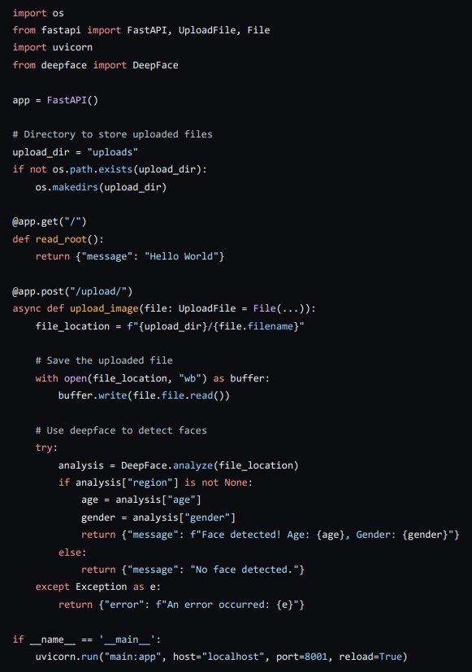

# Project 5 - Age verification with fastAPI


For project 5 the plan was to make an application that where you can upload an image to and than it checks if the person is 18 years or older.

---
The first thing I did was to learn more about `Docker` and how to use it. For that I used this [link](https://www.docker.com/resources/what-container/).
<br>
Than I leaned a bit about how to use `fastAPI` using this [tutorial](https://fastapi.tiangolo.com/tutorial/first-steps/). And I added an endpoint, the code looks like this in Python:
```Python
from fastapi import FastAPI

app = FastAPI()

@app.get("/")
def read_root():
    return {"message": "Hello, World!"}

@app.get("/hello")
def read_hello():
    return {"message": "Hello!"}
```
I also used this [tutorial](https://medium.com/@alidu143/containerizing-fastapi-app-with-docker-a-comprehensive-guide-416521b2457c) to learn more about fastAPI, but also how to create a Dockerfile, an image and a container in Docker.
Now the Dockerfile looks like this: 
```Python
# Use the official Python base image
FROM python:3.9-slim

# Set the working directory inside the container
WORKDIR /app

# Copy the requirements file to the working directory
COPY requirements.txt .

# Install the Python dependencies
RUN pip install -r requirements.txt

# Copy the application code to the working directory
COPY . .

# Expose the port on which the application will run
EXPOSE 8000

# Run the FastAPI application using uvicorn server
CMD ["uvicorn", "main:app", "--host", "0.0.0.0", "--port", "8000"]
```
I also needed to create an requirements.txt, a file with names of the required packages. In this case it looks like this:
```Python
fastapi==0.83.0
uvicorn==0.17.0
```
Than I used this command to create an image in Docker: 
```Python
docker build -t fastapi-hello-world .
```
And to run it I used this command, which also creates a container:
```Python
docker run -p 8000:8000 fastapi-hello-world
```
After this I created a repository in GitHub where I added the Python code. I than learned about `Railway` which is an application that makes it easy to host websites and 
integrate workflows. First I linked my GitHub account to Railway, then I clicked on 'new' and than 'GitHub repo' and clicked on the repo with the fastAPI project. This deployed the repo into Railway. I then went to settings and generated a domain and called it gall-age-verify.up.railway.app. That is the link to go to the fastAPI app. Next I clicked on 'variables' and 'New variable' and named it 'PORT' and gave it the value 8000 which, in the Dockerfile I changed it from 8080 to 8000. This way Railway and the app are on the same port and now the app is hosting online.
<br>
Using Deepface I wrote this script where you can upload an image to and it show the age and the gender:

